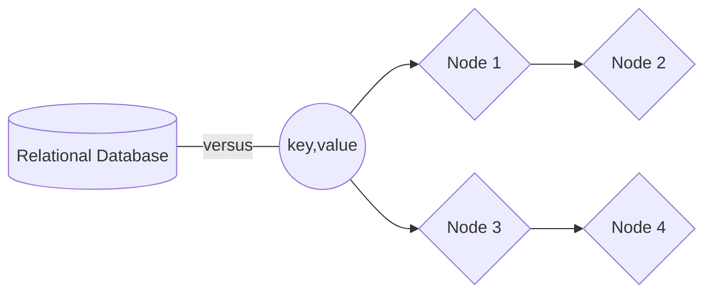

## 10 reasons why not use (key, value) storage as relational database. Especially - distributed cache. 



### Semantical differences
> probabbly not affecting performance, but making your developer's life harder

The result set always `Hashmap` or similar collection like `IDictionary`. It means, you always get a collection of `(key,value)` pairs back as a result of running a query agains the cache. 
What are the implications:

1. If you model the value as a record in database, then the `key` is normally contained withing the record itself, i.e. in the value. But because key-value store is agnostic about the value content and it's structure (if any), it will always hand you back the `keys` and the `values` combined into single collection of (key, value) items. So, you always get the keys twice, wasting you memory space and the traffic.

    ```java
        IKeyValuePair[] result = cache.GetAll(...);
    ```

1. You always get entire collection back. Means all the items are first allocated in the memory space and then returned to the caller. There is no something like stream of records, which you can iterate through and read records one by one. So, you can't do:

    ```java
        IDataReader reader = cache.ExecQuery(...);
        while(reader.ReadNext()) 
        {
            var record = reader.GetData();
            ... 
        }
    ```
    
## Some tables samples

| Heading 1 | Heading 2
| --------- | ---------
| Cell 1    | Cell 2
| Cell 3    | Cell 4

| Header 1 | Header 2 | Header 3 | Header 4 |
| :------: | -------: | :------- | -------- |
| Cell 1   | Cell 2   | Cell 3   | Cell 4   |
| Cell 5   | Cell 6   | Cell 7   | Cell 8   |

    Test code

Header 1 | Header 2
-------- | --------
Cell 1   | Cell 2
Cell 3   | Cell 4

Header 1|Header 2|Header 3|Header 4
:-------|:------:|-------:|--------
Cell 1  |Cell 2  |Cell 3  |Cell 4
*Cell 5*|Cell 6  |Cell 7  |Cell 8


